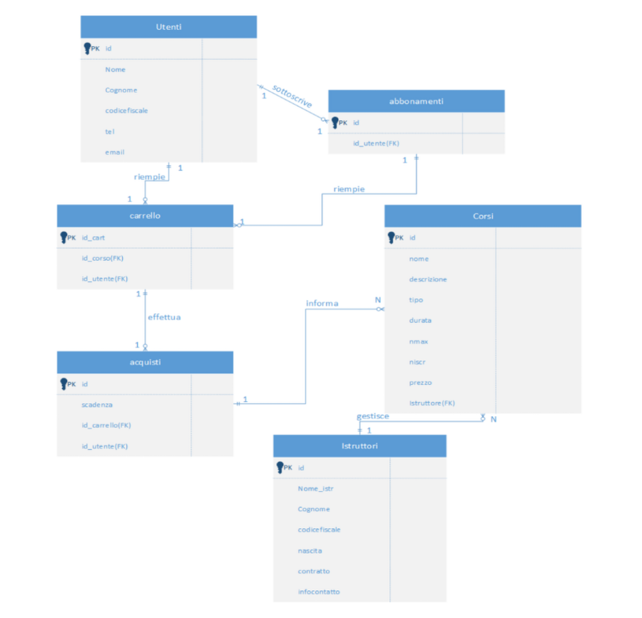

# 🧐 Project Description

Fitness-House is a web platform that allows users to browse and book fitness courses, while enabling instructors and administrators to manage courses and participants. The project is built with Laravel 8 and uses MySQL for database management. Frontend styling is achieved with Tailwind CSS, and dynamic interactions are handled using JavaScript, including jQuery and Alpine.js.


# Table of Contents

- [Project Description](#project-description)
- [Key Features](#key-features)
- [Technologies Used](#technologies-used)
- [Quick Start](#quick-start)
- [Database](#database)
- [Permissions](#permissions)
- [Mobile & Responsive](#mobile--responsive)
- [Challenges & Solutions](#challenges--solutions)
- [License](#license)
- [Author](#author)


# 🧩 Key Features

- Multi-role user management: admin, instructor, user.
- Course creation, modification, and viewing.
- Tracking enrolled users and progress.
- Responsive interface for mobile devices.
- Page access control via middleware.


# 👨‍💻 Technologies Used

### Front-end
- **HTML & CSS**: page structure and layout.
- **Tailwind CSS**: framework for fast and modular styling.
- **JavaScript**: page dynamics and event handling.
  - Libraries: **jQuery**, **Alpine.js**.

### Back-end
- **PHP**: server-side scripting language.
- **Laravel 8**: PHP framework for robust web applications.
  - **Migration**: database structure management.
  - **Eloquent ORM**: mapping models to database tables.
  - **Routes & Controllers**: handling URLs and application logic.
  - **Blade**: template engine for views.
- **MySQL**: relational database managed via XAMPP and PhpMyAdmin.

### Tools
- **Visual Studio Code**: code editor.
- **XAMPP / PhpMyAdmin**: local development server and database management.


## ⚙️ Quick Start

1. Clone the repository:

```bash
git clone https://github.com/MarcoGuastella/Fitness-House.git
cd Fitness-House
```
2. Install PHP and JS dependencies:
```bash
composer install
npm install
```
3. Configure the environment:
```bash
cp .env.example .env
php artisan key:generate
```
4. Run database migrations:
```bash
php artisan migrate
```

5. Start the local server:
```bash
php artisan serve
```
6. Access the app at http://localhost:8000


# 💻 Database
### Conceptual model
The ER diagram allows you to model the real world in the form of entities and relationships between them.



As we can see, tables, in addition to having the attributes listed above, have
foreign keys, which are referential integrity constraints between two tables.
They identify one or more columns in a table, which reference one or more columns in another
table.

### Logic model

Utenti (id, nome, cognome, codicefiscale, tel, email)<br>
Abbonamenti (id, id_utente)<br>
Istruttori (id, nome, cognome, codicefiscale, nascita, contratto, infocontatto)<br>
Corsi (id, nome, descrizione, tipo, durata, nmax, niscr, prezzo, istruttori)<br>
Carrello (id, id_corso, id_utente)<br>
Acquisti (id, scadenza, id_carrello, id_utente)<br>

### Phisical model

### Database Tables

| Table         | Field          | Key   | Type       | Description                  |
|---------------|----------------|-------|------------|------------------------------|
| **Users**     | ID             | PK    | INT        | Auto-incremented             |
|               | first_name     |       | VARCHAR    | User's first name            |
|               | last_name      |       | VARCHAR    | User's last name             |
|               | tax_code       |       | CHAR(16)   | User's fiscal code           |
|               | phone          |       | INT        | User's phone number          |
|               | email          |       | VARCHAR    | User's email                 |
|               | password       |       | VARCHAR    | User's password              |
| **Subscriptions** | ID         | PK    | INT        | Subscription ID              |
|               | user_id        | FK    | INT        | References Users(ID)         |
| **Instructors** | ID           | PK    | INT        | Auto-incremented             |
|               | first_name     |       | VARCHAR    | Instructor's first name      |
|               | last_name      |       | VARCHAR    | Instructor's last name       |
|               | birth_date     |       | DATE       | Date of birth                |
|               | tax_code       |       | CHAR(16)   | Fiscal code                  |
|               | contract_type  |       | VARCHAR    | Type of contract             |
|               | contact_info   |       | VARCHAR    | Contact information          |
| **Courses**   | ID             | PK    | INT        | Auto-incremented             |
|               | name           |       | VARCHAR    | Course name                  |
|               | description    |       | VARCHAR    | Course description           |
|               | type           |       | VARCHAR    | Course type (e.g., yoga)    |
|               | duration       |       | INT        | Duration in hours            |
|               | max_participants |     | INT        | Maximum participants         |
|               | enrolled_count |       | INT        | Number of enrolled users     |
|               | price          |       | INT        | Price of course              |
|               | instructor_id  | FK    | INT        | References Instructors(ID)   |
| **Cart**     | ID             | PK    | INT        | Auto-incremented             |
|               | course_id      | FK    | INT        | References Courses(ID)       |
|               | user_id        | FK    | INT        | References Users(ID)         |
| **Purchases** | course_id      | PK    | INT        | References Courses(ID)       |
|               | expires        |       | DATE       | Expiration date of purchase  |
|               | user_id        | FK    | INT        | References Users(ID)         |

Here’s an example of the SQL used to create the `courses` table:
```sql
CREATE TABLE Courses (
    id BIGINT UNSIGNED AUTO_INCREMENT PRIMARY KEY,
    name VARCHAR(255) NOT NULL,
    description VARCHAR(255),
    type VARCHAR(50),
    duration INT,
    image VARCHAR(255),
    max_participants INT,
    enrolled INT DEFAULT 0,
    price INT,
    instructor_id BIGINT UNSIGNED,
    FOREIGN KEY (instructor_id) REFERENCES instructors(id)
);
```


# 📱 Permissions
If you were logged in as a regular user, you would not be able to access the
admin and instructor pages.

User controller example:
```php
if (Auth::user()->hasRole('user')) {
    $combatti=Upload::select()->where( 'tipo', 'like', '%' .'combattimento' . '%')->get();
    $user = Auth::user('id');
    $corsi = Uploadistr::join('corsi', 'istruttori.id_istr', '=', 'corsi.istruttore')->paginate(8);
    return view('corsi',['combatti'=>$combatti],['corsi'=>$corsi]);
...
```
In this case, it will check whether the logged-in user has the "user" role. If so,
it will assign the following SQL query to the "combatti" variable:
```sql
SELECT * FROM corsi where tipo = 'combattimento'
```
The user ID currently in use will then be assigned to the "user" variable.
The next line assigns the following query to the "courses" variable:
```sql
SELECT * FROM istruttori INNER JOIN corsi on istruttori.id_istr = corsi.id_cors
```
Afterwards the “courses” view will return with “fights” and “courses” as parameters


# 📱 Mobile & Responsive
Thanks to Tailwind CSS and @media rules, the application adapts to different screen sizes, including smartphones and tablets:
```html
<div class="container border-l-2 border-white rounded-md overflow-x-scroll overflow-y-hidden lg:overflow-visible">
```
In the following case, using lg:overflow-visible sets the Large page overflow to
visible.
Using overflow-x-scroll and overflow-y-hidden sets the horizontal overflow to scroll and
the vertical overflow to hidden for mobile devices.


# 🧪 Challenges and Solutions

- Multi-role permissions: implemented middleware and policies in Laravel.
- Complex queries: handling joins and attributes with similar names.
- Responsive design: adapting UI for mobile using Tailwind and @media rules.
- Front-end/back-end integration: syncing dynamic JavaScript with Laravel data.

# ⚠️ License

All designs were created by [Marco Guastella](https://github.com/MarcoGuastella)

# 👤 Author
Marco Guastella